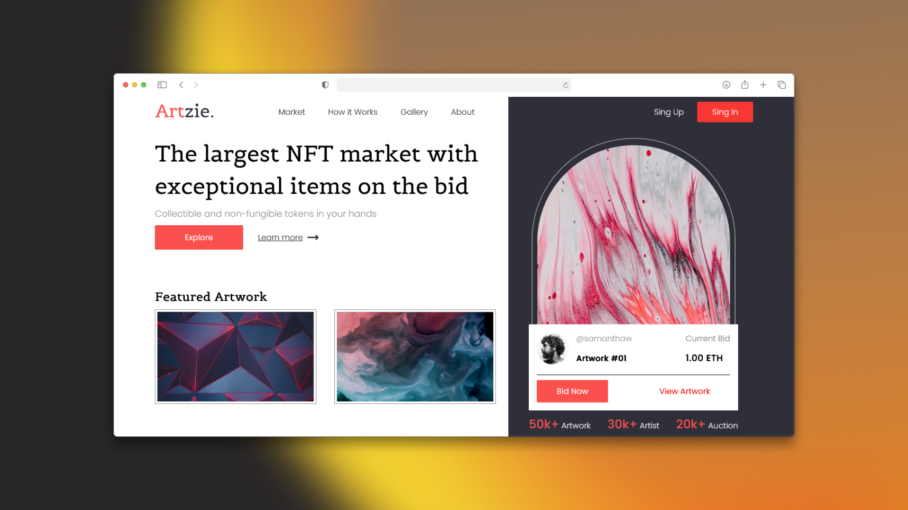

# Artzie NFT Market Landing Page

Bienvenido a **Artzie**, una landing page moderna inspirada en plataformas de subastas NFT. Este proyecto fue creado para practicar y mejorar habilidades en **HTML**, **CSS** y **Sass (SCSS)**, simulando la página principal de un mercado digital de arte y tokens no fungibles (NFTs).

## 🚀 Características

- Diseño visualmente atractivo y profesional, orientado al mundo del arte digital.
- Sección destacada de obras de arte (Featured Artwork).
- Métricas de plataforma: número de obras, artistas y subastas.
- Interfaz de puja directa y botones de acción para explorar y aprender más.
- Navegación clara: Market, How it Works, Gallery, About, registro e inicio de sesión.
- Paleta de colores moderna y tipografía elegante.
- Arquitectura modular de estilos usando **Sass (SCSS)** para mayor organización y escalabilidad.

## 🛠️ Tecnologías utilizadas

- **HTML5** para la estructura semántica.
- **CSS3** para los estilos visuales y el diseño responsivo.
- **Sass (SCSS)** para mantener una arquitectura de estilos modular y eficiente.

## 📚 Propósito del proyecto

Este sitio web fue desarrollado para practicar maquetación web y perfeccionar habilidades en **HTML**, **CSS** y **Sass (SCSS)**, explorando el diseño de interfaces orientadas a productos digitales y subastas NFT. Ideal para quienes quieran aprender a crear interfaces limpias, modernas y escalables.

---

**¡Gracias por visitar este proyecto! Espero que te inspire a seguir aprendiendo y experimentando con el desarrollo web.**
